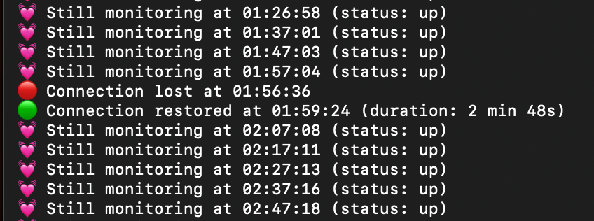
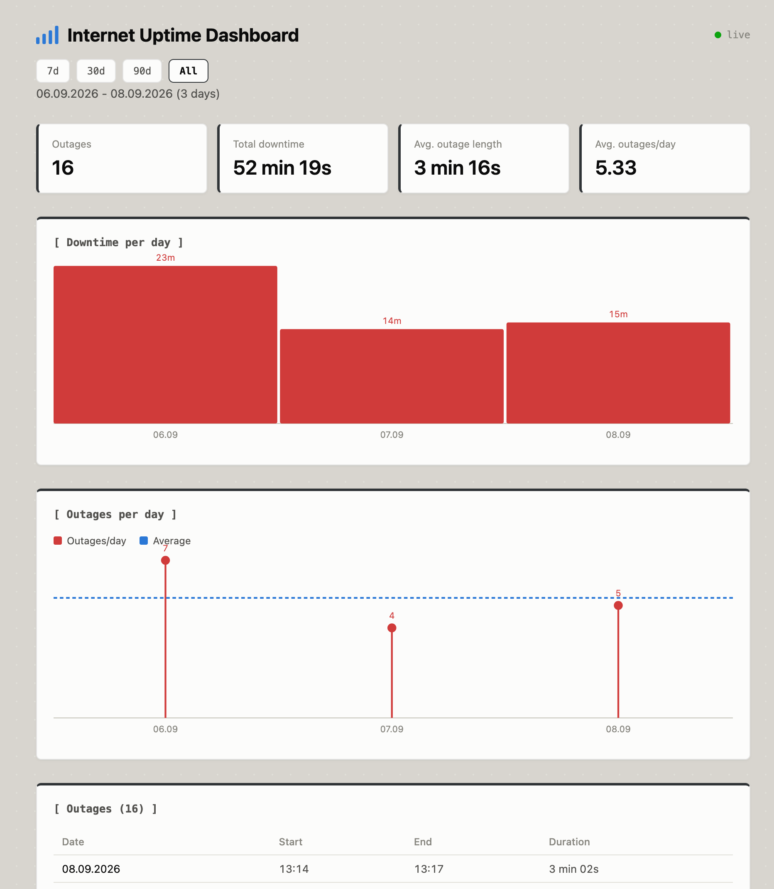

# uptime

A small local tool that monitors your internet connection and reports on outages: how many, when, and for how long.

No dependencies beyond Python 3's standard library.

**Status: v1.0.0 — feature-frozen.** The tool covers what it set out to do (monitor, report, dashboard); no new features are planned for now, only bug fixes if something turns up.

## Usage

### Monitor (run this in a terminal, leave it running)

```bash
python3 uptime.py monitor
```

Checks connectivity every 10 seconds (ping to `1.1.1.1`/`8.8.8.8`). Prints a line — and sends a macOS notification — whenever the connection drops or comes back:

```
🔴 Connection lost at 14:02:11
🟢 Connection restored at 14:02:41 (duration: 30s)
```



The notification means you'll get alerted even if the terminal isn't in the foreground. It's macOS-only (via `osascript`) and fails silently if notifications aren't available (e.g. running headless over SSH) — it never interrupts monitoring.

Press `Ctrl+C` to stop. Restarting after a crash mid-outage correctly resumes tracking that outage instead of losing it.

Every 10 minutes, even with nothing to report, it prints a heartbeat so you can tell it's still alive and hasn't silently died (e.g. from the terminal tab being closed):

```
💓 Heartbeat at 14:12:41
```

Add `--verbose` to also log every individual check (not just drops/recoveries) to `data/checks.log` — useful if an outage doesn't get detected and you need to see what each check actually returned. That file rotates automatically once it passes 5 MB, keeping one backup (`checks.log.1`).

The detection thresholds are also adjustable without touching the code:

```bash
python3 uptime.py monitor --check-interval 5 --failure-threshold 2 --recovery-threshold 3 --heartbeat-interval 300
```

| Flag | Default | Meaning |
|---|---|---|
| `--check-interval` | 10s | delay between connectivity checks |
| `--failure-threshold` | 3 | consecutive failed checks before logging a `down` |
| `--recovery-threshold` | 2 | consecutive successful checks before logging an `up` |
| `--heartbeat-interval` | 600s | delay between heartbeat messages |

### Report

```bash
python3 uptime.py report                    # last 7 days
python3 uptime.py report --days 30          # last 30 days
python3 uptime.py report --date 2026-09-06  # a specific day
```

```
Saturday 05.09.2026: 2 outage(s), 5 min 40s total
  - 10:15 -> 10:19 (4 min 30s)
  - 14:02 -> 14:03 (1 min 10s)
Sunday 06.09.2026: no outages
```

### Dashboard

```bash
python3 uptime.py dashboard                 # last 7 days active by default, opens in your browser
python3 uptime.py dashboard --days 30 --no-open --output ~/Desktop/report.html
```

Generates a self-contained HTML page (no external dependencies) with summary stats, a daily downtime chart, and a full outage table. The page includes four period tabs — **7d / 30d / 90d / All** — precomputed at generation time; clicking one switches the view instantly in the browser, no regeneration needed. `--days` only picks which tab is active when the page first opens.



## How it works

Data is stored in `data/events.jsonl`, an append-only log of connection state changes (not every individual check). `report` and `dashboard` read this file; only `monitor` writes to it.

**Don't edit or delete `data/events.jsonl` while `monitor` is running** — it's your real outage history and isn't backed up.

## Tests

```bash
python3 -m unittest test_uptime -v
```

Covers the pure logic (outage reconstruction, duration/date formatting, dashboard stats, log rotation) — not the actual network check or the live `monitor` loop.
